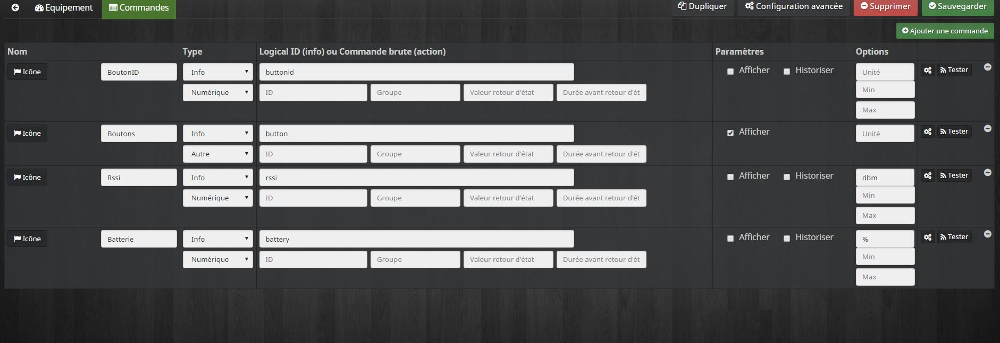

BLEA (anuncio de Bluetooth)
==============================

Description
-----------

Este complemento es un complemento que le permite recibir eventos de ciertos dispositivos bluetooth (como NIU de Nodon)

Configuration
-------------

Configuración del plugin
========================

a. Instalación / Creación

> **Tip**
>
> Para usar el complemento, debe descargar, instalar y
> activarlo como cualquier complemento de Jeedom.

- Después de eso vendrás a esta página :

En esta página tienes poco que hacer. Se recomienda encarecidamente comenzar la instalación de las dependencias (incluso si aparecen bien). Luego, al final de actualizar la página.

> **Important**
>
> Lo más importante aquí es seleccionar su controlador
> Bluetooth

La otra opción disponible en esta página es : **Eliminar automáticamente los dispositivos excluidos**. Esto elimina el equipo Jeedom cuando se excluye..

También puede verificar el estado de las dependencias y reiniciarlas. En caso de problemas con el complemento, reinicie siempre las dependencias, incluso si está bien en caso de duda..

El complemento
=========

Rendez vous dans le menu Plugins &gt; Protocole Domotique pour retrouver le plugin.

En esta página puedes ver los módulos ya incluidos.

En la parte superior de esta página, tiene varios botones..

- Botón de inclusión : este botón permite poner Jeedom en Inclusion.
- Botón de exclusión : este botón permite poner a Jeedom en Exclusion.
- Botón de configuración : este botón abre la ventana de configuración del complemento.
- Botón de salud : Este botón le permite tener una visión general del estado de todos sus módulos.

Equipement
==========

Cuando hace clic en uno de sus módulos, llega a la página de configuración de este módulo. Como en todas partes en Jeedom, puedes aquí en el lado izquierdo :

- Dale un nombre al módulo.
- Activar / hacerlo visible o no.
- Elige tu objeto padre.
- Asignar una categoría.
- Definir un retraso de monitoreo de comunicación para ciertos módulos.
- Publica un comentario.

En el lado derecho encontrarás :

- El perfil del equipo (generalmente se detecta automáticamente si el módulo lo permite).
- Elija un modelo si para este perfil hay varios modelos disponibles.
- Ver lo visual.

Que módulos
=============

Por el momento, solo se reconocen ciertos módulos específicos.

Caso NIU
-----------

NIU es muy fácil de incluir, ponga Jeedom en Inclusion y luego presione el botón (así de simple).

Una vez que se crea la NIU, obtendrá esto :

Tendrás 4 pedidos :

- ButtonId : da una representación digital del tipo de soporte (ideal para escenarios)
  - 01 : prensa simple
  - 02 : doble soporte
  - 03 : pulsación larga
  - 04 : relachement
- Botones : da una representación textual del tipo de soporte
- Rssi : da el valor de intensidad de la señal
- Batería : da el valor de la batería

Otros módulos
--------------------

Se pueden incluir otros módulos, como la baliza NUT, la pulsera fitbit, etc..

Permitirán la detección de presencia con detección en un
Ventana de 1 minuto.

Obviamente se agregarán muchos otros módulos.

Configuración de antena remota
================================

Bluetooth tiene un alcance relativamente limitado, es posible que parte de su hogar esté fuera del alcance de su antena dependiendo de la ubicación de su caja Jeedom.
Pero hay una solución: Es posible extender la red instalando antenas adicionales.

La forma más fácil es usar un raspBerry pi (existente o dedicado dependiendo del equipo que ya tenga). Asumiremos aquí que el raspBerry ya está instalado con un raspbian y que ssh y bluetooth están activados.

Creado la antena
--------------

Debe ir a la página de complementos (Complementos> Protocolo de automatización del hogar) y hacer clic en "Antenas"

1) haga clic en "Agregar"
2) elige un nombre
3) Ingrese la ip y el puerto (22 por defecto)
4) Ingrese el nombre de usuario ("pi" por defecto) y la contraseña
5) Ingrese el equipo bluetooth en el pi ("hci0" en una instalación predeterminada)
6) Guardar

Instalación del demonio.
----------------------

Si no hubo ningún error y su antena está bien creada en el complemento, ahora debe instalar las dependencias necesarias y ejecutar el demonio en la antena que se encargará de hacer el enlace entre los dispositivos Bluetooth en alcance de la antena y el complemento (y, por lo tanto, Jeedom).

1) Haga clic en el botón "Enviar archivos", puede tardar un poco, por favor espere. Aparecerá un banner verde que confirma el éxito, rojo si ha habido un problema.. En este caso, verifique el registro "Blea", verifique la configuración (ip, usuario, contraseña, ...)
2) Luego haga clic en el botón "Iniciar dependencias"". De nuevo, puede llevar tiempo, por favor espere. Un banner verde confirmará el éxito o rojo si no (igual, verifique el registro de Blea)
3) Opcional, puede recuperar manualmente el registro de instalación de dependencias haciendo clic en "Registro de dependencias" y verificar el registro, un archivo de registro específico estará disponible en la configuración del complemento.
4) Si todo va bien, puede hacer clic en "Lanzar el demonio", después de un máximo de un minuto la fecha de la última comunicación debería actualizarse, esto significa que el demonio se está comunicando correctamente con el complemento BLEA.
5) Último paso opcional pero recomendado: activar la gestión automática del demonio haciendo clic en el botón correspondiente. Esto hará que el complemento intente reiniciar automáticamente el demonio remoto en caso de una pérdida de conexión (útil si su pi remoto se ha desconectado temporalmente de la red eléctrica o se ha reiniciado después de las actualizaciones).

Changelog
=========

Registro de cambios detallado :
<https://github.com/jeedom/plugin-blea/commits/master>

Listado de equipos compatibles
=================================

<https://jeedom.github.io/documentation/#equipment>
