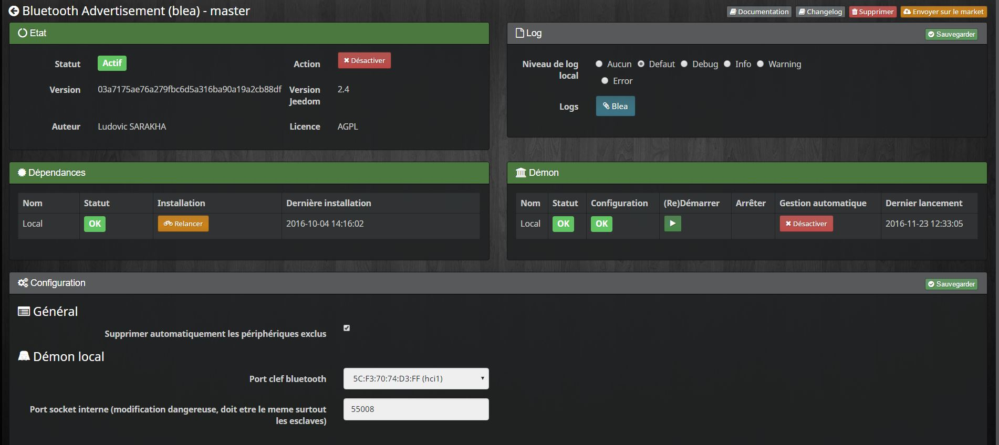
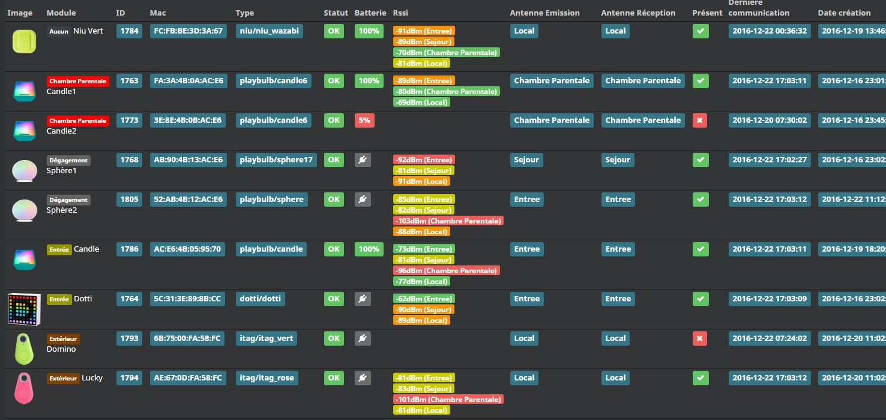

BLEA (Bluetooth advertisement) 
==============================

Description 
-----------

Ce plugin est un plugin permettant de pouvoir recevoir les événements de
certains périphériques bluetooth (tel que les NIU de chez Nodon)

Configuration 
-------------

Configuration du plugin: 
========================

a.  Installation/Création

> **Tip**
>
> Afin d’utiliser le plugin, vous devez le télécharger, l’installer et
> l’activer comme tout plugin Jeedom.

-   Suite à cela vous arriverez sur cette page :

Sur cette page vous avez peu de choses à faire. Il est très vivement
recommandé de lancer l’installation des dépendances (même si elles
apparaissent OK). Puis à la fin de rafraichir la page.

> **Important**
>
> La chose la plus importante ici est de sélectionner votre Contrôleur
> Bluetooth

L’autre option disponible sur cette page est : **Supprimer
automatiquement les périphériques exclus**. Celle-ci permet de supprimer
les équipements de Jeedom lorsqu’ils sont exclus.

Vous pouvez aussi vérifier l’état des dépendances et les relancer. En
cas de soucis avec le plugin, toujours relancer les dépendances même si
OK dans le doute.

Le plugin 
=========

Rendez vous dans le menu Plugins &gt; Protocole Domotique pour retrouver
le plugin.

Sur cette page, vous pourrez voir les modules déjà inclus.

Sur la partie haute de cette page, vous avez plusieurs boutons.

-   Bouton Inclusion : ce bouton permet de mettre Jeedom en Inclusion.

-   Bouton Exclusion : ce bouton permet de mettre Jeedom en Exclusion.

-   Bouton Configuration : ce bouton permet d’ouvrir la fenêtre de
    configuration du plugin.

-   Bouton Santé : ce bouton permet d’avoir un aperçu Santé de tous
    vos modules.

Equipement 
==========

Lorsque que vous cliquez sur un de vos modules, vous arrivez sur la page
de configuration de celui-ci. Comme partout dans Jeedom vous pouvez ici
sur la partie gauche :

-   Donner un nom au module.

-   L’activer/le rendre visible ou non.

-   Choisir son objet parent.

-   Lui attribuer une catégorie.

-   Definir un delai de surveillance de communication pour
    certains modules.

-   Mettre un commentaire.

Sur la partie droite vous trouverez :

-   Le profil de l’équipement (généralement auto détecté si le module
    le permet).

-   Choisir un modèle si pour ce profil plusieurs modèles
    sont disponibles.

-   Voir le visuel.

Quels modules 
=============

Pour le moment, seuls certains modules spécifiques sont reconnus.

Cas des NIU 
-----------

Les NIU s’incluent très facilement, mettez Jeedom en Inclusion puis
appuyer sur le bouton (aussi simple que cela).

Une fois le NIU créé, vous obtiendrez ceci :

Vous aurez ainsi 4 commandes :

-   BoutonId : donne une représentation numérique du type d’appui (idéal
    pour les scénarios)

01 : simple appui

02 : double appui

03 : appui long

04 : relachement

-   Boutons : donne une représentation textuelle du type d’appui

-   Rssi : donne la valeur d’intensité du signal

-   Batterie : donne la valeur de la batterie

Cas d’autres modules 
--------------------

-   D’autres modules peuvent être inclus du type beacon NUT, bracelet
    fitbit, etc.

Ils permettront une détection de présence avec une détection sur un
créneau de 1 minute.

Bien évidemment de nombreux autres modules seront rajoutés.

Changelog 
---------

Changelog détaillé :
<https://github.com/jeedom/plugin-blea/commits/stable>

Liste des équipements compatibles 
---------------------------------

<https://jeedom.github.io/documentation/blea/fr_FR/equipement.compatible>
